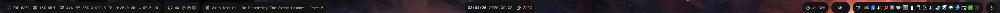
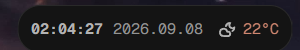
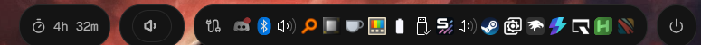
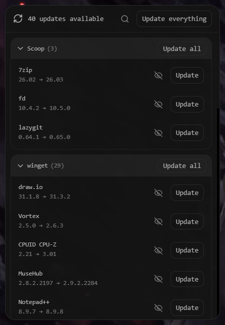
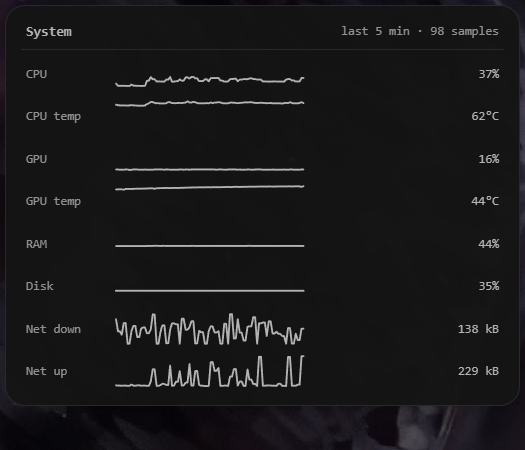
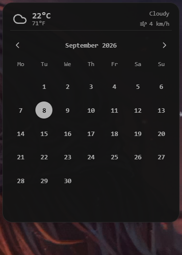
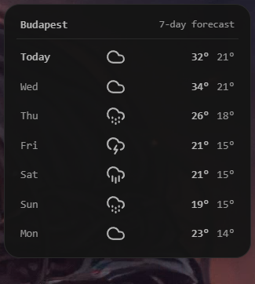
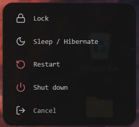

<div align="center">

# overline-zebar — personal build

**A Windows top bar built on [Zebar](https://github.com/glzr-io/zebar): three transparent islands, a live system-metrics panel, and a pamac-style update centre for scoop, winget and Windows Update.**

-8b5cf6)


</div>



---

> **This is a personal fork of [mushfikurr/overline-zebar](https://github.com/mushfikurr/overline-zebar).**
> The widget-pack architecture — the monorepo, the shared `config`/`ui`/`tailwind` packages, the
> `main`, `system-stats`, `config-widget` and `script-launcher` widgets — is upstream's work.
> This branch adds five widgets, a PowerShell update engine, and a rebuilt bar layout.
>
> **Upstream carries no license, so this fork adds none.** See [Credits](#credits).
>
> Everything here is built against **Zebar 3.1.1**, deliberately pinned — see [Build](#build).

---

## What this fork adds

| Addition | What it does |
| --- | --- |
| **`update-panel`** + `engine/` | A ~700-line PowerShell update engine and its modal. Enumerates **scoop**, **winget** and **Windows Update**, then applies updates individually, per channel, or all at once. |
| **`stats-graph`** | Five-minute sparkline history for eight metrics, sampled by the bar into `localStorage`. |
| **`calendar`** | Month view with a live weather header. |
| **`forecast`** | Seven-day forecast from [Open-Meteo](https://open-meteo.com/), for an IP-geolocated location. |
| **`power`** | Lock / sleep / restart / shut down, with confirmation on the destructive actions. Sleep is real S3 sleep (`Application.SetSuspendState(Suspend)` via `pwsh`), never `rundll32 powrprof.dll,SetSuspendState`, which hibernates whenever hibernation is enabled. The widget's `rundll32` privilege only admits `LockWorkStation`, so that call cannot come back. |
| **`helpers/start-menu-reveal`** | AutoHotkey v2 helper: while Start, Search or a shell flyout is in the foreground, the bar is raised `TOPMOST` over a fullscreen app (as the Windows taskbar is), then lowered again. See its [README](helpers/start-menu-reveal/README.md). |
| Rebuilt **`main`** bar | Three transparent rounded islands; an expanded stats readout with CPU/GPU temperatures; uptime; full system tray; GlazeWM-dependent widgets removed. |

## The bar

Three independent islands over a transparent bar, so the wallpaper shows through.

**Left** — system metrics, the auto-hiding update island, and media:


**Centre** — time, date and current conditions. Clicking opens the calendar; clicking the weather opens the forecast:



**Right** — uptime, volume, the full system tray, and the power menu:



CPU/GPU load, temperatures and disk figures come from
[LibreHardwareMonitor](https://github.com/LibreHardwareMonitor/LibreHardwareMonitor)'s local web
server — Zebar exposes neither GPU nor temperature data on its own.

## Panels

Every island opens a panel below it. They close on blur or <kbd>Esc</kbd>.

| Update centre | System graphs |
| --- | --- |
| [](docs/screenshots/update-panel.png) | [](docs/screenshots/stats-graph.png) |

| Calendar | Forecast | Power |
| --- | --- | --- |
| [](docs/screenshots/calendar.png) | [](docs/screenshots/forecast.png) | [](docs/screenshots/power.png) |

## The update island

The headline feature, and the bulk of this fork. An island appears on the bar showing
`N updates` with a per-channel icon, **auto-hiding entirely when there is nothing to do**.
Clicking it opens the modal above: update everything, a whole channel, or one package;
hide a package or skip a single version, with undo.

**A scheduled task refreshes it every 45 minutes**, so the count is current without anyone
asking for it.

### Engine

`engine/` is dependency-free PowerShell 7 — no Pester, no modules to install.

| Script | Role |
| --- | --- |
| `UpdateEngine.psm1` | Parsers, mutex, apply, desktop-icon sweep, last-apply bookkeeping |
| `check.ps1` | Enumerate all channels → `status.json` (scheduled, and "Check now") |
| `apply.ps1` | Apply updates: `-All` / `-Channel` / `-Ids`, with `-WhatIf` |
| `apply-elevated.ps1` | Elevated helper for machine-scope winget and Windows Update |
| `ignore.ps1` | Hide a package or skip a version, and un-hide |
| `deploy.ps1` | Copy the engine to `%LOCALAPPDATA%`, hardening the elevated helper's ACL |
| `install-task.ps1` | Register the scheduled checker |

Runtime state lives in `%LOCALAPPDATA%\overline-updates\`.

### Design properties worth knowing

- **All winget access is serialised** behind a named mutex (`Global\OverlineWingetLock`), ACL'd so
  an elevated helper and the unelevated checker can share it. Two winget processes at once is a
  reliable way to corrupt a package operation.
- **`status.json` is written atomically** (temp file + rename), so a half-written file can never be
  read by the widget.
- **Expensive checks are throttled**, with the last good result carried forward so the count never
  blinks to zero: scoop bucket refresh every ~3 h, the Windows Update COM search every ~4 h.
- **One UAC prompt per batch.** Elevated work is bundled into a single `RunAs` of a fixed script
  driven by a data-only job file — never a command string.
- **The action layer passes arguments as an argv array**, never an interpolated shell string, so a
  package name can't inject a command.
- **Declining the UAC prompt writes a completion sentinel** rather than hanging the modal.

### Tests

```powershell
pwsh -NoProfile -File engine/_test/run-tests.ps1
```

A dependency-free assert harness covering the winget/scoop/Windows Update parsers, the
ignore/stale/interactive merge, atomic IO, and the apply layer.

### Known limitation

Every winget item is currently treated as `scope='machine'`, so *every* winget update routes
through the elevated helper and raises a UAC prompt — including genuinely user-scope packages.
Mostly that is a redundant prompt, but some user-scope packages misbehave under elevation.
Refining scope detection is the highest-value improvement here.

## Project layout

```
packages/          shared config, UI components, Tailwind and TS config   (upstream)
widgets/
  main             the bar itself                                        (rebuilt)
  system-stats     hover panel                                           (upstream)
  config-widget    settings GUI                                          (upstream)
  script-launcher  quick script launcher                                 (upstream)
  update-panel     update centre modal                                   (added)
  stats-graph      5-minute metric history                               (added)
  calendar         month view + weather header                           (added)
  forecast         7-day Open-Meteo forecast                             (added)
  power            power menu                                            (added)
engine/            PowerShell update engine + tests                       (added)
helpers/
  start-menu-reveal  raise the bar over fullscreen apps while Start is open (added)
docs/              design spec and implementation plan for the update island
```

## Build

> **Do not build against Zebar 3.3.x.** This tree targets the **3.1.1** runtime; the newer provider
> calls fail silently against it. The pnpm catalog pins `zebar: '3.1.1'` exactly — a `^3.1.0` range
> would resolve to 3.3.1.

```bash
npm i -g pnpm@9.15.0     # or: corepack pnpm@9.15.0
pnpm install
pnpm build
```

The postbuild hook kills and restarts `zebar.exe` — that is expected, not an error. The restarted
Zebar inherits the build's output handles, so a build run from a script or agent shell that waits for
its output **does not return until Zebar exits** — the build itself is long done (check `dist/`).

### Deploy

Copy each widget's `dist/` over the installed pack, **keeping the pack directory name identical**:

```
%APPDATA%\zebar\downloads\mushfikurr.overline-zebar@1.0.3\widgets\<widget>\dist
```

The name matters: the active theme lives in `localStorage`, which is keyed by pack name, so
renaming the pack silently loses the theme. A change to a widget's **privileges** must also be made
in the installed pack's `zpack.json` (patch the widget's entry — the installed file has local preset
values, so do not overwrite it wholesale) and needs a Zebar restart. Then deploy the engine and
register the checker:

```powershell
pwsh -NoProfile -File engine/deploy.ps1
pwsh -NoProfile -File engine/install-task.ps1
```

## Theming

Themes are stored in `localStorage` under `overline-zebar-config`, **not** in the source, so they
survive every rebuild. The build shown here uses a pure-black OLED theme
(`--background: #000000`) with muted grey text.

## Credits

Built on **[mushfikurr/overline-zebar](https://github.com/mushfikurr/overline-zebar)** — the widget
pack, shared packages and original bar are their work, and the upstream README documents the
architecture and the widget-authoring workflow in `widgets/README.md`.

Upstream publishes **no license**, so no license is asserted here either; this fork inherits that
position. If you want to reuse anything from it, ask upstream first.

Also uses [Zebar](https://github.com/glzr-io/zebar) (glzr-io),
[LibreHardwareMonitor](https://github.com/LibreHardwareMonitor/LibreHardwareMonitor),
[Open-Meteo](https://open-meteo.com/) and [Lucide](https://lucide.dev/) icons.
